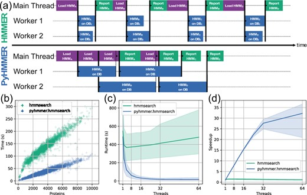

# PyHMMSearch
Fast implementation of [`HMMSearch`](https://github.com/EddyRivasLab/hmmer) optimized for high-memory systems using [`PyHmmer`](https://github.com/althonos/pyhmmer).  `PyHMMSearch` can handle fasta in uncompressed or gzip format and databases in either HMM or Python pickle serialized format.  No intermediate files are created. 

### Installation:

```
pip install pyhmmsearch
``` 

### Dependencies: 

* pyhmmer >=0.10.12
* pandas
* tqdm


### Benchmarking:

| Database | Tool            | Single Threaded | 12 Threads |
|----------|-----------------|-----------------|------------|
| Pfam     | PyHMMSearch     | 2:24            | 0:20       |
| Pfam     | HMMER HMMSearch | 2:53            | 2:27       |

\* Time in minutes for 4977 proteins in `test/test.faa.gz`.  

Official benchmarking for `hmmsearch` algorithm implemented in `PyHMMER`  against `HMMER` from [Larralde et al. 2023](https://academic.oup.com/bioinformatics/article/39/5/btad214/7131068): 





### Usage:
Recommended usage for `PyHMMSearch` is on systems with 1) high RAM;  2) large numbers of threads; and/or 3) reading/writing to disk is charged (e.g., AWS EFS).  Also useful when querying a large number of proteins. 

* #### Using the official Pfam database files:

    ```bash
    # Download database
    DATABASE_DIRECTORY=/path/to/database_directory/
    mkdir -p ${DATABASE_DIRECTORY}/Annotate/Pfam
    wget -v -P ${DATABASE_DIRECTORY}/Annotate/Pfam https://ftp.ebi.ac.uk/pub/databases/Pfam/current_release/Pfam-A.hmm.gz 

    # Run PyHMMSearch
    pyhmmsearch.py -i test/test.faa.gz  -o output.tsv -b ${DATABASE_DIRECTORY}/Annotate/Pfam/Pfam-A.hmm.gz -p=-1
    ```

* #### Build a serialized database:

    ```bash
    # Provide a database
    serialize_hmm_models.py -d path/to/Pfam-A.hmm.gz  -b path/to/database.pkl.gz

    # or a directory of HMMs
    serialize_hmm_models.py -d path/to/hmm_directory/  -b path/to/database.pkl.gz

    # or from a list of filepaths to HMM models
    serialize_hmm_models.py -l path/to/hmms.list  -b path/to/database.pkl.gz

    # or form a list through stdin
    ls path/to/directory/*.hmm |  serialize_hmm_models.py -b path/to/database.pkl.gz
    ```

* #### Using the serialized database files:

    Database can be uncompressed pickle or gzipped pickle. 

    ```bash
    pyhmmsearch.py -i test/test.faa.gz  -o output.tsv -b ~/Databases/Pfam/database.pkl.gz -p=-1
    ```

* #### Using a custom threshold table (e.g., BUSCO Markers):

    ```bash
    pyhmmsearch.py -i test/test.faa.gz  -o output.tsv -d test/bacteria_odb10/bacteria_odb10.hmm.gz -s test/bacteria_odb10/scores_cutoff -f name -p=-1
    ```

* #### Grouping hits by query protein:

    ```bash
    reformat_pyhmmsearch.py -i pyhmmsearch_output.tsv -o pyhmmsearch_output.reformatted.tsv
    ```

#### Options:

```
$ pyhmmsearch.py -h
usage: pyhmmsearch.py -i <proteins.fasta> -o <output.tsv> -d

    Running: pyhmmsearch.py v2024.4.25 via Python v3.10.14 | /Users/jolespin/miniconda3/envs/kofamscan_env/bin/python

options:
  -h, --help            show this help message and exit

I/O arguments:
  -i PROTEINS, --proteins PROTEINS
                        path/to/proteins.fasta. stdin does not stream and loads everything into memory. [Default: stdin]
  -o OUTPUT, --output OUTPUT
                        path/to/output.tsv [Default: stdout]
  --no_header           No header

Utility arguments:
  -p N_JOBS, --n_jobs N_JOBS
                        Number of threads to use [Default: 1]

HMMSearch arguments:
  -s SCORES_CUTOFF, --scores_cutoff SCORES_CUTOFF
                        path/to/scores_cutoff.tsv [id_hmm]<tab>[score_threshold], No header.
  -f {accession,name}, --hmm_marker_field {accession,name}
                        HMM reference type (accession, name) [Default: accession]
  -t SCORE_TYPE, --score_type SCORE_TYPE
                        {full, domain} [Default: full]
  -m {gathering,noise,e,trusted}, --threshold_method {gathering,noise,e,trusted}
                        Cutoff threshold method [Default:  e]
  -e EVALUE, --evalue EVALUE
                        E-value threshold [Default: 10.0]

Database arguments:
  -d HMM_DATABASE, --hmm_database HMM_DATABASE
                        path/to/database.hmm cannot be used with -b/-serialized_database
  -b SERIALIZED_DATABASE, --serialized_database SERIALIZED_DATABASE
                        path/to/database.pkl cannot be used with -d/--database_directory.  Database should be pickled dictionary {name:hmm}

Copyright 2024 Josh L. Espinoza (jolespin@newatlantis.io)
```


#### Outputs:

* From **pyhmmsearch.py**:

    | id_protein                 | id_hmm     | threshold                                | score   | bias  | best_domain-score | best_domain-bias | e-value   |
    |----------------------------|------------|------------------------------------------|---------|-------|-------------------|------------------|-----------|
    | SRR13615825__k127_453760_1 | PF00389.34 | (24.600000381469727, 24.600000381469727) | 93.686  | 6.702 | 89.856            | 6.702            | 1.984e-27 |
    | SRR13615825__k127_295655_1 | PF00389.34 | (24.600000381469727, 24.600000381469727) | 83.195  | 0.005 | 83.167            | 0.005            | 3.456e-24 |
    | SRR13615825__k127_218710_3 | PF00389.34 | (24.600000381469727, 24.600000381469727) | 42.235  | 0.004 | 42.073            | 0.004            | 1.559e-11 |
    | SRR13615825__k127_272080_1 | PF00389.34 | (24.600000381469727, 24.600000381469727) | 24.673  | 0.000 | 22.067            | 0.000            | 4.154e-06 |
    | SRR13615825__k127_297426_1 | PF02826.23 | (25.100000381469727, 25.100000381469727) | 170.426 | 0.003 | 170.122           | 0.003            | 6.392e-51 |

* From **reformat_pyhmmsearch.py**:

    | id_protein                 | number_of_hits | ids                                        | evalues                          | scores                    |
    |----------------------------|----------------|--------------------------------------------|----------------------------------|---------------------------|
    | SRR13615825__k127_453760_1 | 3              | ['PF00389.34', 'PF02826.23', 'PF03446.19'] | [1.984e-27, 2.113e-39, 2.41e-08] | [93.686, 132.902, 32.336] |
    | SRR13615825__k127_295655_1 | 2              | ['PF00389.34', 'PF02826.23']               | [3.456e-24, 7.794e-21]           | [83.195, 72.421]          |
    | SRR13615825__k127_218710_3 | 1              | ['PF00389.34']                             | [1.559e-11]                      | [42.235]                  |
    | SRR13615825__k127_272080_1 | 2              | ['PF00389.34', 'PF02826.23']               | [4.154e-06, 2.035e-41]           | [24.673, 139.471]         |
    | SRR13615825__k127_297426_1 | 1              | ['PF02826.23']                             | [6.392e-51]                      | [170.426]                 |

* From **reformat_pyhmmsearch.py** with **-b/--best_hits_only**:

    | id_protein                 | id         | evalue    | score   |
    |----------------------------|------------|-----------|---------|
    | SRR13615825__k127_453760_1 | PF02826.23 | 2.113e-39 | 132.902 |
    | SRR13615825__k127_295655_1 | PF00389.34 | 3.456e-24 | 83.195  |
    | SRR13615825__k127_218710_3 | PF00389.34 | 1.559e-11 | 42.235  |
    | SRR13615825__k127_272080_1 | PF02826.23 | 2.035e-41 | 139.471 |
    | SRR13615825__k127_297426_1 | PF02826.23 | 6.392e-51 | 170.426 |


#### If you use this tool, please cite the following sources: 

* Eddy SR. Accelerated Profile HMM Searches. PLoS Comput Biol. 2011 Oct;7(10):e1002195. doi: 10.1371/journal.pcbi.1002195. Epub 2011 Oct 20. PMID: 22039361; PMCID: PMC3197634.

* Larralde M, Zeller G. PyHMMER: a Python library binding to HMMER for efficient sequence analysis. Bioinformatics. 2023 May 4;39(5):btad214. doi: 10.1093/bioinformatics/btad214. PMID: 37074928; PMCID: PMC10159651.


#### License:

The code for `PyHMMSearch` is licensed under an MIT License

Please contact jolespin@newatlantis.io regarding any licensing concerns.
